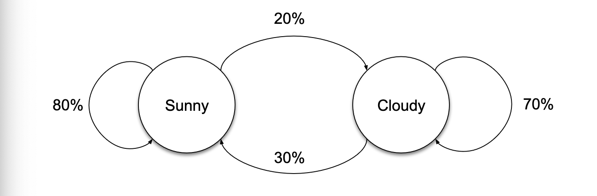
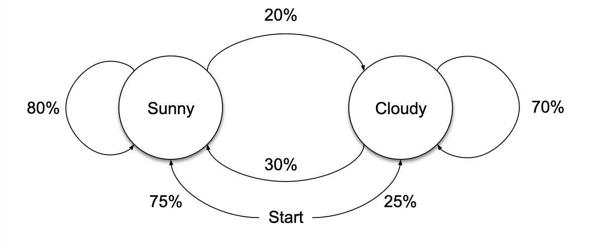
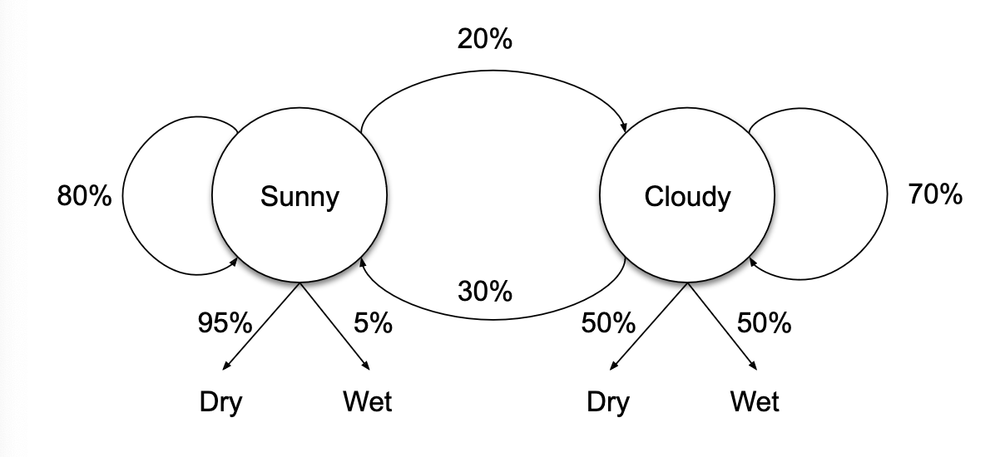
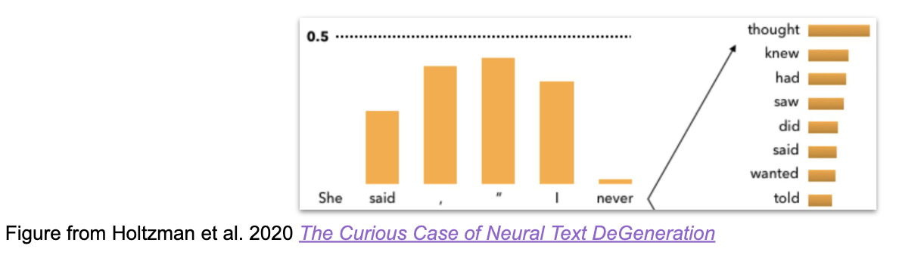

# TKO 7095 Intro to human language technology

Notes from lecture slides

## HLT

### What is HLT

Natural language equals human language, different from formal and artificial languages such as programming languages

2 key challenges

* Variety:
  * Same meaning can be expressed in many different ways
  * You don't get it - You don't understand it
* Ambiguity
  * Same form can express different meanings based on context
  * different meanings for eg. tie

### NLP

Computational methods to analyze, understand or generate human language

#### Applications

Language is the most efficient way we have to communicate _meaning_

* Reasonably easy to describe a picture or music using words
* Very hard to describe music using a picture, or a book using dance

A large portion of what is presented as AI is actually build on NLP models:

* DALL-E
* MusicLM

Text correction and generation

* Spelling and grammar check
* Autocorrect and predictive text
* ChatGPT

Web search includes a lot of NLP

* Disambiguation
* Text classification
* Information retrieval
* Question answering
* Information extraction

Machine Translation

* DeepL

Chatbots and generative AI

Text to speech

* Eg. speak written books with ai machine voice

Speech recognition and subtitling

Filterin and moderation support via:

* Sentiment analysis
* Text filters

#### Language as data

##### Methods

* Simple statistics == counting
  * How many words / chars
  * word frequencies

* Segmentation == Divide bigger units into smaller ones
  * Almost always part of raw text preprocessing in NLP pipeline
  * _Tokenization_ / _word segmentation_
    * Segment text into individual tokens == word-like elements
    * _Sentence splitting / sentence segmentation_ == Segment text into individual sentences
    * _Stemming / lemmatization_ == reduce words to base forms
    * _Syntactic analysis / parsing_ == Identify syntactic structure of sentences

## CORPORA

A corpus is a _structured_ and _documented_ collection of language data

* Text corpus == collection of written text
* Speech corpus == collection of spoken language (audio)

Corpora come in a broad variety of types, from minimally structured (doc boundaries only) to comprehensively analyzed (Universal dependencies)

Corpora are the fuel that powers NLP, and the ability to use and create corpora if necessary is a key skill

### Definitions

Text corpora can be broadly categorized by their annotation

* Raw text corpora: Plain, unstructured
* Annotated text corpora: markings from some information of intrest

Annotations can be almost anything: Language, domain, genre, topic, sentence/token boundaries, morphology, syntax, fluency, sentiment, emotion, toxicity, names, dates, addresses, relations, events.

Annotations can mark elements at various levels of granularity: document, paragraph, sentence, token, character

#### Corpora

Can be categorized into two different things:

* Manually annotated corpora: Annotations made by humans
* Automatically annotated corpora: Annotations made by a machine

Also it's common for manually annotated corpora to use some level of automation == Though correction of machine-predicted annotations.

Manually annotated corpora are generally preferred for _quality_, but typically have much higher _cost_ to create

#### Unannotated corpora

Raw text corpora without annotation are broadly used in NLP, not only as material for _linguistic analysis_ but also for _training language models_.

* Large neural models trained on unannotated text (eg. to predict next word) are the basis for many breakthrough advances in NLP over the last 5+ years
* For example GPT-3 was trained only on unannotated data (mostly web crawl), while ChatGPT and GPT-4 training also includes annotated data.
* The size of corpora that can be effectively used in NLP has increased massively in the last decades: BNC(British national corpus) 100milloin words at -94, now biggest models use more than trillion words.

#### Annotated corpora

In the central of developing NLP methods:

* _Evaluation_ to determine how well a method performs, its annotations are compared to human annotations ("gold standard")
* _Training_ for machine learning based approaches human annotations are used to train the ML methods.
* The type of annotation needed depends on the NLP task

#### Representation

Representations of annotations can be grouped into two primary categories:

1) Inline annotations: Inserted directly into the text HTML / XML
2) Standoff annotations: Stored separately from the tet; annotated parts of text are identified e.g. through character offsets

## Text annotation

### Annotation tasks

* Text classification: Genre, topic, sentiment ...
* Token/span classification: part-of-speec, named entity recognition, chunking
* Token/span normalization: entity linking, lemmatization, word sense disambiguation ...
* Relation annotation: Dependency syntax, entity relation, coreference
* Free-text annotation: Question answering, translation, summarization

Corpora frequently combine multiple categories of annotation: for example a corpora
annotated for information extraction may include named entity, entity relation and normalization annotation

#### Text classification

Assign each _text_ a label or a set of labels from predefined categories, e.g. genres

#### Token classification

Assign each _token_ a label or a set of labels from predefined categories. Data can be represented as sequence of (token, label) pairs potentialy organized into sentences == part-of-speech tagging

#### Span classification

Assign spans of tokens labels from predefined categories

Data can be represented as sequence (start,end,label) tuples or Begin-In-Out tags, for example NER

##### Span classificataion: BIO tags

Begin-In-Out tagging is frequently used to represent annotation that marks (non-overlapping) sequences of tokens

* Begin: Start of annotated span
* In: token inside annotated span
* Ou: not part of annotated span

Also reduced form IO (In-Out) and extended form IOBES (+End-Single)

#### Span normalization

Associate _spans of tokens_ with identifiers from external resources

Data can be represented as sequence of (start, end, id) tuples, for example enitity linking

#### Relation annotation

Associate tokens or spans with other tokens or spans

Data can be represented as sequence of (from, to, relation) tuples, it assumes identifiers from the from and to items

Dependency relations

#### Free-text annotation

Associate corpus text with arbitrary output text

Data can be represented as (input-text, output-text) pairs

Machine translation

### Annotation process

A small annotation project for a well-defined target may be completed by a single person in hours (e.g. spam marking)

Larger annotation projects frequently involve several annotators, tens of thousands of annotations or more. It can take months or years and requre careful planning

* Annotation coordinator or lead annotator oversees the process and makes final decisions in cases of disagreement
* Annotation guideline documents the task, overall guidelines, and specific decisions made to resolve difficult or diagreed cases
* Inter-annotation agreement is used to monitor annotation quality and consistency

#### Possible workflow

* Select annotation targets, representation and tools
* Select texts to annotate (may overlap with annotation)
* Draf annotation guidelines
* Hire annotators
* Initial annotator training, measuring inter-annotator agreement
* Refinement of annotator guidelines
* Primary annotation process including:
  * Monitoring inter-annotator agreement, identifying sources of disagreement
  * Updating guidelines, revisiting prior annotation if changed
  * Training new annotators
* Final consistency checking, documentation and release

#### Text sources

Most text corporas are build on pre-existing texts rather than creating new ones

* Allows capturing real language use, avoids effort and expense of creating text

In NLP, corpora used to be build on newswire, newspaper and other traditionally published sources, but recently increasingly on internet sources

The choise of text source depends on goals: for example, unannotated corpora tend to emphasize _size_, while annotated corpora emphasize _quality_

## Document representation and classification

### Classification

Process:

* IN: document
* OUT: label(s)

To be understood in a very broad sense

* Document can be anything from a few words to a whole book
* Label can be anything from positive/negative to hierarchies of tens of thousands of classes

Binary classification: One positive/negative label to be predicted, a special case of multi-class with class number == 2
Multi-class classification: one label from a larger label vocabulary to be predicted
Multi-label: a number of labels to be predicted from a larger label vocabulary

#### Binary classification

* Spam detection
* Sentiment analysis (pos/neg)
* Fake news detection
* Churn prediction
* Legal document classification
* Clickbait Detection

#### Multi-class classification

* Topic categorization
* Language identification
* Handwriting recognition
* Emotion detection
* Product actegorization
* Customer segmentation
* Document genre classification
* Essay grading
* ChatGPT :o'

#### Multi-label

* Set of topics to a document from a larger topic category
* MeSH Medical Subject Headings classify each biomedical publication with 10-15 terms
* News article tagging
* Medical condition prediction
* Customer support ticket tagging

### Document classification as a ML problem

* The text document needs to be reduced into a set of features
* A classifier can then be trained on the task as usual
* Input representation to a classifier tends to be fixed-length: a feature vector
* The space of features is enormous (one feature for each possible word in the language leading to a very sparce vector)
* Language tends not to be fixed

#### BoW Bag of Words representation

The feature vector has as many elements as there are words in the vocabulary. A non-zero value is set for words present in the document, zero for words absent. Any standard classifier can use this representation as its input

PLUS:

* Simple and fast to compute
* Works with any standard classifier
* Deceptively simple -> may give suprisingly good results in many keyword-driven classification tasks
* In many applications this can be the most bang for the buck solution!

MINUS:

* No encoding of order: "the dog chases the cat" has same representation as "the cat chases the dog"
* Long, sparse feature vectors are a challenge for any ML techniques

#### Multi-layer preceptron MLP

One input for each vocabulary item (possible word) is set to 0 if absent, non-zero if present

##### MLP in NLP

The input layer width is massive - one inpt for each vocabulary item. Most inputs are set to zero, only those seen in the input text are set to a non-zero value. It is more natural to think in terms of "embeddings". Each possible input is assigned a trainable vector, its embeddings. These can then be summed, producing the input representation. This is fully equivalent to the traditional definition of MLP, the embedding simply corresponds to the weights fanning out from a single input node in the "classical" MLP

##### Embeddings

Embeddings is a central concept in NLP.

A learned representation of an input feature, typically a dense vector of some hundreds to low thousands in length. Typically starts its life as a randomly initialized embedding matrix, then adjusted by the model during its training, and saved together with the model. The size of the embeddings matrix is one of the factors which dictate that we should keep our vocabulary quite limited (typically tens of thousands of items)

### Basic training pipeline - the practicalities

* Data with text and labels usually split in to train, validation and test sections
* Tokenize the text and map onto a vocabulary (tokens into integers)
* Batch examples and pad sequences of unequal length
* Design a model
* Train the model on the train data

#### Data

Typically list of dictionaries, keys for the various properties for each datapoint. In classification, minimally text and class label.

If not pre-divided into train-val-test sections, then you need to divide the data yourself

#### Tokenize and map vocabulary

* Split text in to words
* Map words into numerical indices in a vocabulary
* You may need to build the vocabulary too
* The class name also needs to be mapped into a 0-based integer

#### Batch and pad

* NLP is mostly based on neural networds and these are trained on batches of examples
  * Computational efficiency on GPU
  * Numerical stability of the gradient descent optimization
* Examples are represented as tensors (quite often just vectors and matrices)
* Text examples are not same length and must be padded to form a tensor
* Must make sure the padding "0" is understood throughout as a special value, and not a token index

#### Model

We will use torch to implement our models and the HuggingFace libraries so we can naturally continue in the Deep Learning course

The model is a class

* __init__(args) initializes the learnable parameters (layer weight matrices, embeddings etc)
* forward(inputs) carries out the computation on a single batch, computes loss
* Generally speaking, forward() will receive the contents of one batch dictionary at a time

#### Training

Runs the training loop

* Batch of data is fed into the model's forward function
* The function calculates the output for the batch and if labels are given also the loss
* The loss is almost uniquely crossentropy in the simple classification case
* Model weights are updated by a step in the opposite direction of the loss gradient, the length of the step depends on the learning rate witch is a parameter

The Trainer class automatized this for us.

## Sequence labeling

### SL Definitions

Basic task setting:

* Input: text represented as sequence of tokens
* Output: label(s) for each _token_ from predefined categories

For most tasks, exactly one label per token

Contrast with text/document classification: Label(s) for _text as whole_

#### Terminology

* Some sequence labeling tasks termed "token classification"
  * Note potential confusion with "sequence classification" for document classification
* Label, class and tag are here _largerly synonymous_ depending on task

### SL Tasks

* POS - Part Of Speech tagging, labels: VERB, NOUN, ADJ, ...
* NER - Named Entity Recognition, labels: PERSON, LOCATION, ORGANIZATION, ...
* Chunking / partial parsing, spans corresponding to for example verb and noun phrases

Also segmentation, morphological tagging, semantic role labeling, text zoning (introduction, methods, results, etc.) Generally any task involving marking _spans_

### SL as feature generation

In a "traditional" NLP pipeline, sequence labeling tasks used in part to create features for later tasks, for example:

* Parts of speech serve as features to indentify noun and verb phrases (chunking)
* Parts of speech and chunk tags serve as features to identify named mentions

Explicit features introduced in this way generally not used in recent deep learning approaches, here still used for illustration and interpretability

#### SL Challenges

Ambiguity and context dependence:

* POS tagging: "can" as noun vs. aux verb, "house" as noun vs. verb
* NER: "Washington" as person vs. location, "Nokia" as organization vs. location

Label dependencies:

* POS (DET, NOUN) likely e.g "the dog", (DET,VERB) unlikely e.g "this is"
* NER (B-PERSON, I-PERSON) is valid, (B-PERSON, I-ORGANIZATION) is invalid

### SL Representation

Build on ideas from document classification:

* Supervised machine learning: train model based on annotated corpus
* Explicitly defined features: manually build appropriate features for task

By contrast to document classification approach, we _cannot_ apply a simple bag-of-words approach to sequence labeling and
hope for good results

* Losing order of words would make many cases _undecidable_
* Consider "We can see a can"

We _cannot_ simply consider each token as its own "document" == needs context, or just make a BOW from a whole sentence == cannot differentiate!

Instead we'll here rely on two well-tested ideas for representing text for sequence labeling:

1) Context windows: Create features form fixed-size "window" of tokens before and after each token we're classifying
2) Relative positions: Represent the position of context tokens and their features with respect to the token we're classifying.

#### SL Context window

Most sequence labeling decisions are comparatively _local_, with distant tokens contributing little useful information

* Especially POS tagging and other morphology-level labeling largely sentence-internal

For classifying a token, only represent information from its immediate context instead of e.g entire document.

#### SL Relative positions

The _order_ in which tokens appear in the input is key to many sequence labeling tasks, POS tagging for example.

* "can see a..." -> "can" is auxiliary verb
* "see a can..." -> "can" is noun

The key piece of information is _not_ absolute position in the input, but relative position with respect to the token being labeled

Explicitly encode relative position to focus word in features

##### Explicit features

For document classification each word form was used as its own separate feature

* Features include eg ```cat```and ```dog```for words _cat_ and _dog_

More generally we can explicitly define any feature we like

We'll here represent these in text, for example:

* ```token[-1]=dog```the preceding token is "dog"
* ```pos[+1]=NOUN```the next token is a noun (POS tag has value NOUN)
* ```chunk[0]=B-NP```the current token starts a noun phrase

Note: these are _text strings_ representing the presence of a feature; there is nothing special about their form.

Explicit feature representations allow us to represent arbitrary categorical information about the focus token and context tokens, e.g.

* Does the token start with a capital letter?
* What are the last two characters of the token?
* What two-word sequence (bigram) starts at the token?
* Does the token appear in a list of known names?
* Does the token consist only of letters / digits / puncts?

Categorical features can also be introduced for the window, sentence or document as a whole, and for some ML methods features can also be given weights TF/IDF

### SL Sum

Each token in the dataset form its own example of classification, where:

* Features are generated from a _fixed-size window_ around the token
* _Relative position_ with respect to the focus token is represented to capture word order and distance
* _Explicit features_ are defined to represent relevant information about the focus token and other tokens in the window (surface form)

We can use these as a "bag of features" with the MLP classifier

#### What's still missing?

For MLP represented is:

* Context window (locality)
* Relative word order (sequence order, distance)
* Arbitrary categorical aspects of the input (explicit features)

However, predictions for each token were made _independently_ of each other

* No attempt to model label dependencies
* May predict very unlikely or invalid label sequences

### SL Methods

Sequence labeling tasks can be addressed through _heuristic_ and _rule-based_ approaches

* For example, dictionary-based approach to NER: compile lists of known names with types (person etc), find occurences in the text

State-of-the-art sequence labeling methods are based on supervised ML. Broadly speaking almost any ML method _can_ be used for sequence labeling. Methods that inherently capture sequential nature of data and can model _label dependencies_ are particularly good fit

Methods capturing sequential order and/or label dependency information include:

* Hidden Markov Models (HMM)
* Conditional Random Fields (CRF)
* Recurrent Neural Network (RNN)
  * Long Short-Term Memory (LSTM)
  * Gated Recurrent Unit (GRU)
* Transformer models
  * Bidirectional (BERT)
  * Encoder - Decoder (T5)

### SL Models

#### Basics of graphical models


Two states (Sunny and cloudy) with probabilities of transitioning between the two ased on the current state: a _first-order_ markov model

For each state, we have a probability of _starting_ the prcoess in the state



For each state, we have probability of _emitting_ a particular _observation_



#### HMM

First-order Hidden Markov MOdel (HMM) is defined by:

* Set of (hidden) states $X_1,...,X_n$ and possibe outputs $Y_1,...,Y_m$
* Start probabilities for each state
* Transition probabilities between states
* Emission or output probabilities for each state and output

Given this information, we can answer questions such as:

* What is the probability of a particular state sequence?
* What is the probability of a particular output?
* What is the probability of a state sequence _given_ output?

In basic application to sequence labeling, the hidden states $Y_i$ correspond to the labels (POS or NER tags for example) and the outputs $X_i$ to tokens

Parameters can be straightforwardly set given annotated data

#### Metrics

_Token-level_ classification _accuracy_ (correct predictions out of all predictions) generally used to evaluate task

For tasks invlving marking _spans_ (NER) performance typically measured on span level in terms of exact-match precision, recall and F_1 score

* Compare predicted and gold standard spans in terms of (start-token, end-token, type)
  * Only triples where all values match between predicted and gold are correct
* Precision: fraction of predicted spans that are correcnt
* Recall: fraction of gold standard spans that are correctly predicted
* $F_1$-score: balanced harmonic mean of precision and recall

## Language models

### LM Definitions

Task setting:

Learn to assign probabilities to sequences of words

* Input: corpus of raw, unannotated text (typically very large)
* Output model that can estimate $P(w_1, w_2, w_3, ... , w_n)$ i.e how likely is the word sequence in the language

Language modelling methods and uses changed dramatically over last decade

* Traditionally: n-gram models (bigram, trigram, ...) and approaches based on _counting_
* Recently: Neural network models (MLP, RNN, transformer) trained in _predicition_

Probability of word sequence estimated via probabilities of individual words in their context. Language models can be grouped into two broad categories by how that context is defined:

* Causal LMs: Estimate probability of word given previous words only only! (one-directiona, "left-to-right")
* Bidirectional LMs: Estimate probability of word given both preceding and following words

Broadly speaking, causal LMs are particularly effective in _generation_ and bidirectional LMs in _classification_

#### LM Tasks

##### Traditional tasks

* Spell and grammar checking: Detecting and correcting errors in text
* Short text generation: autocomplete, predictive text input
* Speech recognition: phoneme and word prediction
* Machine translation: ranking alternative translations
* Language identification: which language is text most likely in
* Text quality filtering

Broadly tasks involving _identifying unlikely spans_ of text or _ranking alternatives_ by their likelihood or belonging to a language

##### Modern tasks

* Chatbots: natular language dialogue on arbitrary topics
* Question answering: providing relevant responses to queries
* Summarization: short abstractive versions of input text
* Code completiong: software develpment support
* Machine translation: end-to-end translation, e.g. Finnish in, english out
* Zero- or few-shot tasks: e.g. text classification with very few examples

And many many more, increasingly any "low-lever" cognitive task that people can perform without training

## Count-based language models

Count-based modelling is a simple statistical approach to creating LMs. In the most typical case

* Input: sequence of words $(w_1 w_2 w_3 ...)$ representing large text corpus
* Output: model that can estimate probability of word given previous words $P(w_n | w_1 w_2 w_{n-1})$

Approach is estimating probability P using occurence counts C in corpus. There is an obvious issue with naively applying the probability estimate. Namely for every longer sequences of words, _the counts will be zero_. Key challenge for count-based LMs is the _sparsity of the data_, almost all interesting non-trivial texts will be entirely novel == new and original.

Example: What is the next word in the headline:
"Trump faces 'Real Danger Zone' from Mike Pence ..."?

### N-grams

_Data is finite_ and the counts of almost all longer word sequences will be zero.

Solution: instead of using the full "history" of previous words, only consider the previous _N_ words

* Bigram model: $P(w_n | w_{1:n-1})$
* Trigram model: $P(w_n | w_{n-2:w-1})$
* 4-gram model: $P(w_n | w_{n-3} w_{n-2} w_{n-1})$

Roughly in practice, bigram and trigram models simple to make but weak, 4- and 5-gram require substantial data, and larger than 7-gram rare due data requirements

N-gram model can be estimated from counts using _maximum likelihood estimate_

$P(w_n | w_{n-N+1:n-1}) = C(w_{n-N+1:n}) / C(w_{n-N+1:n-1})$

For example, for a bigram model we have simply:

$P(w_n | w_{n-1}) = C(w_{n-1:n})/C(w_{n-1})$

The probability estimate for a longer text can then be calculated using the _chain rule_

$P(w_1,...w_n) = \prod_{k \in \{1,...,n\}}P(w_k|w_{k-N+1:k-1})$

#### Smoothing and backoff

N-grams make count-based approach _possible_, but _zero counts_ will remain. Zero counts lead to $P(words) = 0$ estimates, which is useless for most applications.

Solution: apply _smoothing_ to either counts or probability estimates to avoid zeros

* Add-one smoothing == Laplace smoothing: simply add 1 to all counts
* Add-k smoothing: add fixed value k to counts (typically $k < 1$)
* Advanced smoothing methods: Knerser-Ney, Good-Turing, etc.

Alternatively when encountering a zero count, _back off_ from using an N-gram estimate to using an (N-1)-gram estimate 

#### Numerical precision

Applying the chain rule to estimate the probabilities of a longer text involves _multiplying togeher many small probabilities_

Mathematically this is fine, but computers have limited ability to represent very small or very large values

remember float restrictions!

Solution: use log probabilities:

$p_1 \cdot p_2\cdot...\cdot p_n = exp(log(p_1)+log(p_2)+...+log(p_n))$

### Generation

Given a causal language model, it's straightforward to generate text:

1) Initialize _text_ to desired "prompt" or a start-of-text token (e.g. `<s>`)
2) Select next word _w_ from $P(w | text)$ and append it to _text_
3) Repeat previous step as long as desired (e.g. max-tokens or `</s>` sampled)

A naive selection strategy for step 2. is to always take the _most likely next word_ w:

$argmax_wP(w|text)$

BUT this type of _greedy decoding_ often gets trapped in repetition loops:

```"I don't know. I don't know. I don't know".```

and only produces "predictable" text. Strategies for better generation than greedy decoding include

* Randomly sampling the next word from the distribution $P(w | text)$
  * _Temperature_ parameter to (de)emphasize likely words
  * Limiting to _top-k words_ or a probability treshold (_top-p_ aka _nucleus sampling_)
* _Beam search_ to find likely sequences that start with a less likely word
* Filtering for redundancies, "bad words", etc



### Evaluation

Two common settings for LM evaluation:

1) Use _text to evaluate model_ or compare models, which assumes good text
2) Use _model to evaluate texts_, which assumes good model

For either case, the most common evaluation metric for LMs is _perplexity_ (PPL), the inverse probability of text normalized by the number of words

$PPL(w_1w_2...w_n) = P(w_1w_2...w_n)^{-1/N}=\sqrt[n]{\frac{1}{P(w_1w_2...w_N)}}$

PPL can be thought of as the weighted average number of words that can follow a word.

### N-gram limitations

N-gram models have been a key tool in NLP for decades, but have their clear limitations:

* _Limited use of context_ due to short history (N) and unidirectionality
* _Data sparcity_ means difficult estimating rare N-grams
* _High resource usage_ due to storage of large N-gram tables
* _No word similarity_ `cat != dog`, `cat != hat`
* Fixed vocabulary, out-of-vocabulary (OOV) words

## Prediction-based language models

Basic setup dentical to count-based models:

* Input: sequence of words $(w_1,w_2,...)$ representing large text corpus
* Output: model that can estimate probability of word given previous words $P(w_n | w_1,w_2,...w_n)$

Instead of deriving $P(words)$ from counts, predict it directly. Basically any method capable of learning to predict a probability distribution is applicable, but in practice focus on _neural network_ models: MLP, RNN, etc.

### LMs as representation learners

Language model solves in the end quite complex task. Prediciting the next word is by no means easy. Requires a good understanding of the language structure. Requires word knowledge (!) These properties make language modelling a good general task to learn representations of text units == embeddings

* Focus on _word_ embeddings
* In later courses we expand to longer text segments

#### Two-sided context

Language models are traditionally causal (left-to-right). This is due to how they were typically used in applications.

* E.g. speec recognition lattice decoder

For representation/embedding learning, we can also consider language models with two-sided context. This is due we do not benefit from causality, almost the contrary.

#### The word2vec model

`Yle website targeted in ____ attack`

Given this context, we want to predict the missing word, as a distribution. Word2vec is a very influential model in NLP. Makes two simplifying assumptions:

* Limit the left and right context window length
* Disregard word order

##### Language modelling as BoW classification problem

When you think about it, this is casting language modelling as a simple bag of words classification problem:

* Bag of Words as the input features
* Multiclass classification with every word in the vocabulary being one possible class
* Because we want the embeddings of input features / words

#### Word2vec continue

* A linear MLP
* Input/output layers as wide as the vocabulary
* Input-to-hidden layer weights learn embeddings
* Hidden-to-output layer weights discarded after training
* Embeddings are relatively short vectors
* $D(embedding lenght)$ is some 200-300

##### Word2vec training "Context BoW"

Can be trained as a normal classifier. Context goes in as bag of words. Word in the example is predicted.

##### Word2vec training "skip-gram"

Reduced to word pairs, given a single word, predict the distribution of words nearby. Thanks to the linear structure of the model, this is really not much different from CBOW above

#### W2V embeddings

Word2vec is trained on very large textual corpora. This is easy and very fast, the model is simple and includes several technical optimizations. After training, we retrain the embedding matrix of the model. Every vocabulary word thus has a single static learned vector embedding. "Similar" words get numerically similar embeddings.

##### W2V usage

* Primary use: pretrained representations that can be used to initialzie the embedding matrix of models for downstream tasks
* The embeddings encode information about the meaning of words, even if they are rare / missing in the supervised training data, which is often quite small

For example the word "crummy" might be seen only once in the IMDB training data, bot giving enouch opportunity to learn it as a negative feature. The word2vec embeddings are trained on much larger textual corpus, and the _embeddings for "crummy" is close to other negative words which the classifier may benefit from_.

The embeddings are affected by the w2v training data. Embeddings are one by word, conflating (== uniting) the different meanings of a ambiguous words. The embeddings are also _static_, unaffected by the present context in which the word is used.

##### Properties of embeddings

* Small context windows (+/-2): nearest words are syntactically similar words in same taxonomy.
  * Nearest neighbours for "hogwards" are other fictional schools: "sunnydale", "evernight", "blandings"
* Larger context windows (+/-5): nearest words are related words in same _semantic_ field:
  * Hogwarts nearest neightbors are Harry Potter world: Dumbledore, half-blood, Malfoy

##### Word analogy

Does not work nearly as often as you'd like, but it is very impressive when it does work.

Embeddings reflect the data meaning compute a bias for every adjective for example how much closer the adjective is to "woman" synonyms than "man" synonyms or names of particular ethnicities

* Embeddings for competence adjective (smart, wise, brilliant, resourceful, thoughtful, logical) are biased towards men, a bias slowly degreasing 1960-1990
* Embeddings for dehumanizing adjectives (barbaric, monstrous, bizarre) were biased towards Asians in the 1930s, bias decreasing over the 20th century

##### Alignment of embedding spaces

* Cross-lingual embeddings: a shared embedding space across languages
* The goal is to embed meaning, not words
* Same meaning (regardless of language) == same/near vector representation

Embeddings can shift in vector on timeline!

There are two general ways of alignment of embedding spaces.

1) Build an aligned space from scratch
2) Build two separate spaces and map them onto each other after the fact

##### Alignment though pseudowords

* Gather a multilingual corpus of texts
* Train a single set of embeddings on the multilingual data
* But there is no signal forcing alignments to emerge, the languages will end up living in their own subspaces
* Solution: Replace words by multilingual pseudowords
  * A large dog#koira runs in the yard#piha
  * Suuri dog#koira juoksee pihalla
* Then learn the embeddings the usual way, on the multilingual data
* The pseudoword embediings are forced to be the same across the languages
* And that has effect on other embeddings too, effectively "forcing" the spaces to align

##### Alignment through mapping

* Given two embedding spaces and a set of word/vector pairs between these, we can induce a tranformation matrix mapping from one space to another

##### Cross-lingual alignment

* in other words we need a set of word pairs between two languages, and their respective monolingual embeddings
* This can be seen as "training" data for inducing the mapping matrix $M$. The matrix $M$ minimizes the mean square error (MSE) between $SM$ and $T$ target
* Dimenionality does not need to match

#### Embeddings evaluation

There are many methods to induce word embeddings from text and different parameters for one method.

How can we evaluate the embeddings?

* Intrinsic: Direct evaluation of the properties of the embeddings
* Extrisic: Evaluation of the embeddings in a downstream task for example incorporating the embeddings in a classifier / tagger and observing the performance on some classification / tagging taks

##### Intrisic

* Word similarity
* Word analogy: `A is to B as C is to ___`
  * Implemented arithmetically as $B-A+C$
* Concet categorization
  * sandwich, tea, pasta, water should form 2 groups (food, drink)
* Outlier detection
  * breakfast, _cereal_, dinner, lunch

##### W2V influence to NLP

W2V and other similar models were an important stepping stop towards todays NLP. In particular the present-day GPT models can be seen as a culmination of work which set out to:

* Make embeddings not static == make them context-dependent
* Deal with out-of-vocabulary items

Very roughly the progression was Word2vec -> convolutional NNs -> recurrent NNs -> attention models / Transformer NN
